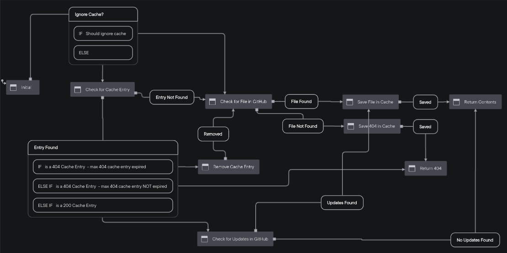

# Status

Notice: This library is still in alpha and the api and some of the caching logic could still change.

# github-contents-cache

A helpful utility for retrieving and caching file contents from GitHub's contents API.

## The problem

You want to store files on GitHub and retrieve the contents from those files using [GitHub's contents API](https://docs.github.com/en/rest/reference/repos#contents) - using GitHub as a CMS for your .mdx blog posts, hosting .csv monthly reports, html template files, etc - but you also want to make sure to be a good API citzen and stay within the rate limit by caching file contents and only updating the cache when the file contents change using [conditional requests](https://docs.github.com/en/rest/overview/resources-in-the-rest-api#conditional-requests). But as the [saying goes](https://martinfowler.com/bliki/TwoHardThings.html), cache invalidation is hard. Especially when you then also have to think about how to handle all of the other edge cases like - "Should I cache 404 responses? And for how long?", "What if I receive an error from GitHub? 500 response or a malformed return body?", "What if I want to explicitly ignore the cache for certain requests?" - you get the idea.

## This solution

You are responsible to bring your own cache instance - redis, sqlite, disk, etc. This library will manage the lifecycle for making requests to GitHub and setting, updating, and removing contents from the cache. The diagram belows shows just an idea of things covered in the lifecycle - check the tests to see all the covered cases.



## Installation

This module is distributed via [npm][npm] which is bundled with [node][node] and
should be installed as one of your project's `dependencies`:

```
npm install --save github-contents-cache
```

Or, you can install this module through the [yarn][yarn] package manager.

```
yarn add github-contents-cache
```

## Supported Node Versions

Current version supported is >=14

## Usage

```js
import getContentsFromGithub from "github-contents-cache";

try {
  // Currently, this will only pull content from the default branch of the repo but we may look
  // at adding the ability to define a different branch in the future.
  const results = await getContentsFromGithub({
    // REQUIRED: Personal access token with repo scope - https://github.com/settings/tokens
    // As always with access tokens, be careful to not commit your token!
    token: GITHUB_AUTH_TOKEN,
    // REQUIRED: Owner of the repo
    owner: OWNER,
    // REQUIRED: Repo name
    repo: REPO,
    // REQUIRED: Path from the root of the repo
    path: `content/${slug}.mdx`,
    // OPTIONAL: Whether or not to use the cache for this request
    // default: false
    ignoreCache: false,
    // OPTIONAL: How long to wait before allowing a cached 200 to look in GitHub for changes
    // default: 0 - always check in GitHub for changes
    // 304 from GitHub does not count against the api limit
    maxAgeInMilliseconds: 10000,
    // OPTIONAL: How long to wait before allowing a cached 404 to look in GitHub again.
    // default: Infinity - cache indefinitely (pass ignoreCache true to break the cache for the entry)
    // 404 from GitHub counts against the api limit
    max404AgeInMilliseconds: 10000,
    // REQUIRED: Be a good API citizen, pass a useful user agent
    // https://docs.github.com/en/rest/overview/resources-in-the-rest-api#user-agent-required
    userAgent: "GitHub user <your username>",
    // OPTIONAL: If you want to transform your file contents in some way before they are cached
    serialize: async (fileContentsString) => {
      const { code, frontmatter } = await bundleMDX({
        source: fileContentsString,
      });
      return { code, frontmatter };
    },
    // REQUIRED: Methods you provided to be able to get, set, and remove content from your cache instance
    // The path arg provided to the get, set, and remove methods below will be the same as the
    // path option given above
    cache: {
      // Should set the entry in your cache instance. If you want to make updates to the file
      // contents before they are stored - use the serialize method above
      set: async (path, entry) => {
        await blogCache.set(path, JSON.stringify(entry))
      },
      // Should return the entry exactly as it was provided as the second arg of the set method above
      // If a falsey value is returned, it will be assumed the entry was not found in the cache
      get: async (path) => {
        const cacheResults = await blogCache.get(path);
        if (!cacheResults) {
          return null;
        }
        return JSON.parse(cacheResults.value);
      },
      // Should remove the cache entry
      remove: async (path) => {
        await blogCache.remove(path)
      },
    },
  });

  if (results.status === "found") {
    // results.content will either be a string with the file contents, or
    // whatever was returned from the serialize method if provided
    return {
      code: results.content.code,
      frontmatter: results.content.frontmatter,
      cacheHit: results.cacheHit,
    };
  }

  if (results.status === "notFound") {
    // We didn't find this file in GitHub
    throw new Response(null, { status: 404 });
  }

  if (results.status === "error") {
    // These errors could range from errors thrown in the serialize or cache instance methods provided
    // or an unexpected error from the GitHub api
    console.warn(results.message, results.error);
    throw new Response(null, { status: 500 });
  }

  if (results.status === "rateLimitExceeded") {
    // You could use the timestampTillNextResetInSeconds to implement logic to only return cached
    // entries until the reset happens. GitHubs api limits are pretty generous though so you hopefully
    // would never run into this if your content on GitHub changes infrequently and their aren't
    // errors coming from the provided cache instance
    const { content, limit, remaining, timestampTillNextResetInSeconds } = results;
    console.warn(
      "We've reached our github api limit", { limit, remaining, timestampTillNextResetInSeconds }
    );
    // Hit the limit but we found something in the cache for this request
    if (results.cacheHit) {
      return {
        code: results.content.code,
        frontmatter: results.content.frontmatter,
        cacheHit: results.cacheHit,
      };
    }
    // Hit the limit and didn't find anything in the cache
    throw new Response(null, { status: 500 });
  }

  throw new Error("Unexpected status");
} catch (error) {
  if (error instanceof Response) {
    throw error;
  }

  console.warn(error);

  throw new Response(null, { status: 500 });
}
```

## LICENSE

MIT

[npm]: https://www.npmjs.com/
[node]: https://nodejs.org
[yarn]: https://yarnpkg.com
